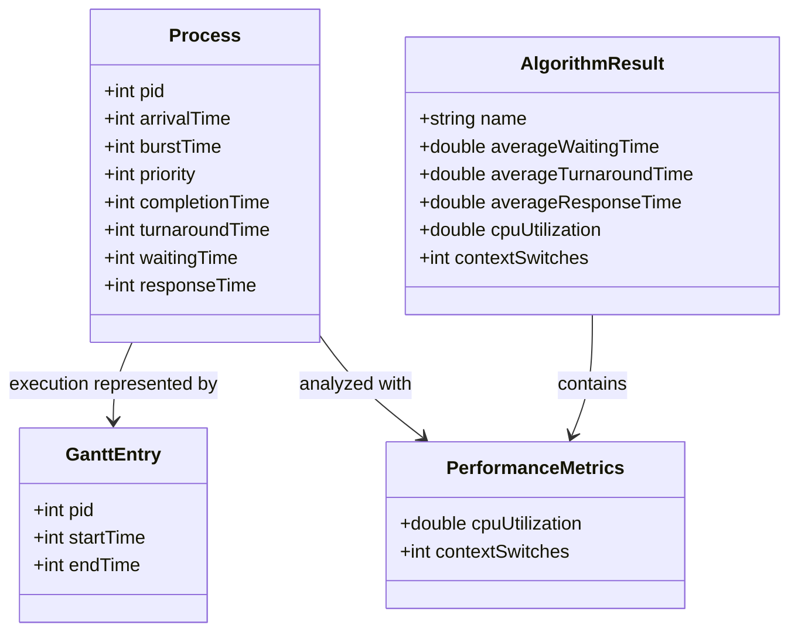
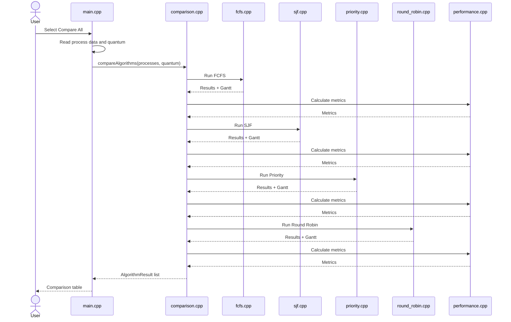
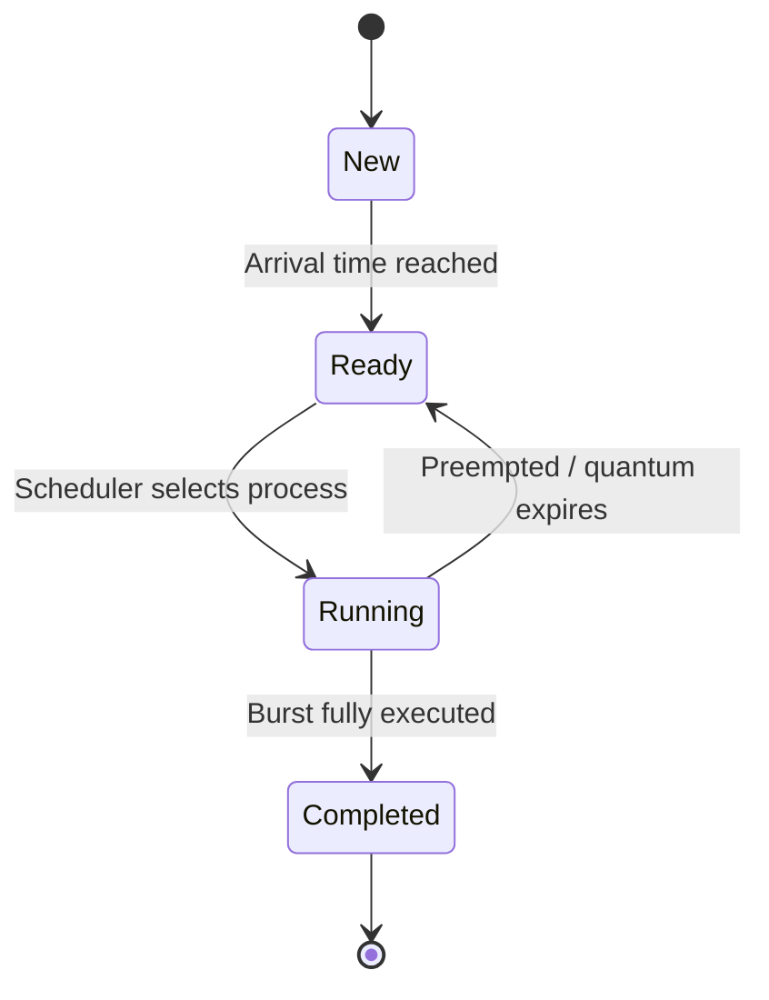

# UML Diagrams

## 1. Class/Data Structure Diagram

The project is primarily modular/procedural C++ rather than class-heavy object-oriented C++. The following diagram therefore models the central structures.

## 2. Sequence Diagram – Compare All

## 3. State Machine – Simulated Process

### State Descriptions

| State | Meaning |
|---|---|
| New | Process exists but has not reached arrival time |
| Ready | Process is available for scheduling |
| Running | Process is assigned CPU time |
| Completed | Process has finished its burst |

Round Robin can return from Running to Ready when the quantum expires and burst time remains.
